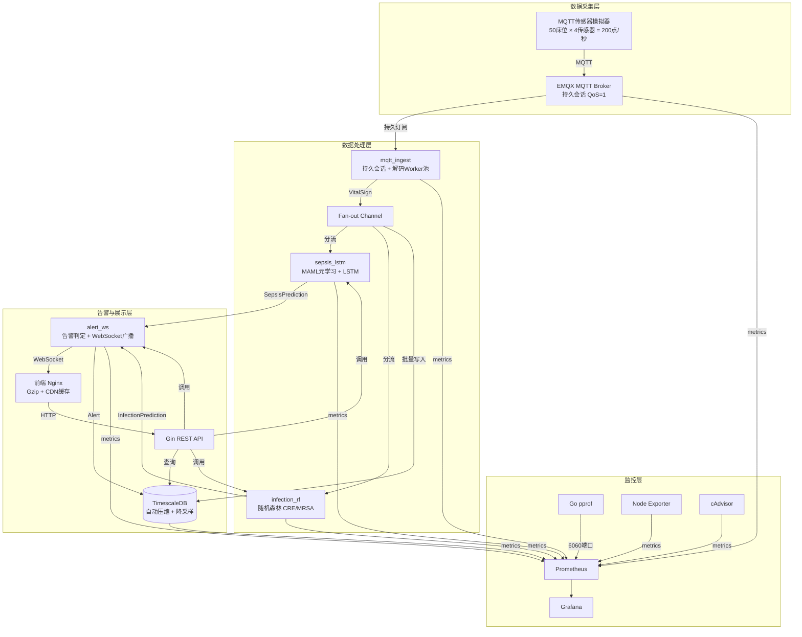

# 战地医院移动ICU患者生命体征与院内感染风险预测系统

一套完整的战地医院移动ICU生命体征监测与风险预警全栈系统。50个床位、200个传感器每秒上报，基于LSTM+MAML的脓毒症早期预警和随机森林的院内感染风险预测。

---

## 目录

- [系统架构](#系统架构)
- [核心特性](#核心特性)
- [技术栈](#技术栈)
- [快速开始](#快速开始)
- [模块说明](#模块说明)
- [模拟器配置](#模拟器配置)
- [监控与运维](#监控与运维)
- [API 接口](#api-接口)
- [数据保留策略](#数据保留策略)
- [部署说明](#部署说明)
- [开发指南](#开发指南)

---

## 系统架构



### 数据流向

```
MQTT消息(200/s) → mqtt_ingest(解码) → VitalSign Chan → fan-out
                                                   ├─→ sepsis_lstm(MAML+LSTM) → SOFA评分 + 风险概率
                                                   └─→ infection_rf(随机森林) → CRE/MRSA风险
                                                                                      ↓
                                          alert_ws(去重+分级+WebSocket广播) → 前端实时告警
                                                                                      ↓
                                          TimescaleDB(批量写入+压缩+降采样) → 30天原始/1年降采样
```

---

## 核心特性

| 模块 | 特性 |
|------|------|
| **MQTT 通信** | CleanSession=false 持久会话，断线重连不丢消息，QoS=1，4个解码Worker |
| **脓毒症预警** | MAML元学习快速适应患者个体差异，LSTM时序推理，SOFA评分计算 |
| **感染预测** | 随机森林100棵决策树，CRE/MRSA双风险预测，抗生素/侵入操作特征 |
| **告警引擎** | 三级分级(warning/high/critical)，时间窗口去重，WebSocket实时广播 |
| **数据存储** | TimescaleDB超表，异步批量写入(500批)，自动压缩，降采样聚合 |
| **监控运维** | Prometheus全链路指标，pprof性能剖析，Grafana可视化看板 |
| **前端展示** | Canvas床位布局图，ECharts热力图，Nginx Gzip压缩，静态资源CDN缓存 |
| **模拟器** | 50床位1秒间隔，可配置脓毒症事件注入(normal/low/medium/high) |

---

## 技术栈

### 后端
- **Go 1.21** - 主语言
- **Gin 1.9** - Web框架
- **TimescaleDB 2.13 (PG16)** - 时序数据库
- **EMQX 5.6** - MQTT Broker
- **pgx/v5** - PostgreSQL驱动
- **paho.mqtt.golang** - MQTT客户端
- **Prometheus client_golang** - 指标采集
- **gorilla/websocket** - WebSocket
- **Viper** - 配置管理

### 前端
- **原生 JavaScript (ES6+)** - 无框架依赖
- **Canvas 2D API** - 床位布局渲染
- **ECharts 5** - 热力图与曲线图
- **IIFE 封装** - 组件化

### 运维
- **Docker + Compose** - 容器化部署
- **Prometheus 2.51** - 时序指标存储
- **Grafana 10.4** - 可视化监控
- **cAdvisor** - 容器指标
- **Node Exporter** - 主机指标

---

## 快速开始

### 前置要求
- Docker 24.0+
- Docker Compose v2+
- 4GB+ 可用内存
- 10GB+ 可用磁盘

### 一键启动

```bash
# 1. 克隆项目
git clone <repository-url>
cd field-hospital-icu

# 2. 复制环境变量
cp .env.example .env

# 3. 启动全部服务
docker-compose up -d

# 4. 查看服务状态
docker-compose ps

# 5. 查看日志
docker-compose logs -f backend simulator
```

### 验证启动

| 服务 | 地址 | 默认账号 |
|------|------|----------|
| 前端 | http://localhost | - |
| 后端API | http://localhost:8080 | - |
| EMQX Dashboard | http://localhost:18083 | admin / public |
| Prometheus | http://localhost:9090 | - |
| Grafana | http://localhost:3000 | admin / admin123 |
| Go pprof | http://localhost:6060/debug/pprof/ | - |

### 快速测试

```bash
# 查看床位列表
curl http://localhost:8080/api/beds

# 查看感染风险热力图数据
curl http://localhost:8080/api/infection/risk

# 查看统计数据
curl http://localhost:8080/api/statistics

# 查看Prometheus指标
curl http://localhost:6060/metrics
```

---

## 模块说明

### 1. mqtt_ingest - MQTT摄入模块

**文件**: [backend/mqtt_ingest/ingest.go](backend/mqtt_ingest/ingest.go)

- 持久会话配置: `CleanSession=false`, `ResumeSubs=true`
- 解码Worker池: 可配置数量（默认4）
- 非阻塞投递: 队列满时丢弃并计数
- 输出: `VitalChan chan<- models.VitalSign`

**关键配置** (config.yaml):
```yaml
mqtt:
  cleansession: false
  keepalive: 60
  messagechanneldepth: 10000
  decodeworkers: 4
  decodequeuesize: 20000
```

### 2. sepsis_lstm - 脓毒症LSTM推理模块

**文件**: [backend/sepsis_lstm/predictor.go](backend/sepsis_lstm/predictor.go)

- MAML元学习: 内循环/外循环，快速个性化适应
- LSTM推理: 4特征输入（ECG/呼吸机/SpO2/体温）
- SOFA评分: 4项体征综合评分
- 全局单例: `sepsis_lstm.Instance`

**关键配置** (config.yaml):
```yaml
ml:
  lstm:
    inputsize: 4
    hiddensize: 32
    mamlweight: 0.7
    sofaweight: 0.3
  maml:
    innerlr: 0.01
    outerlr: 0.001
    adaptsteps: 5
    seqlength: 30
```

### 3. infection_rf - 感染风险随机森林模块

**文件**: [backend/infection_rf/predictor.go](backend/infection_rf/predictor.go)

- 100棵决策树，投票取中位数
- CRE/MRSA双风险分别预测
- 抗生素天数、侵入操作次数作为特征
- 全局单例: `infection_rf.Instance`

**关键配置** (config.yaml):
```yaml
ml:
  randomforest:
    numtrees: 100
    treeweightmin: 0.5
    treeweightmax: 1.0
    creriskantibioticcoef: 0.03
    creriskinvasivecoef: 0.02
    mrsariskantibioticcoef: 0.025
    mrsariskinvasivecoef: 0.025
```

### 4. alert_ws - 告警引擎+WebSocket模块

**文件**: [backend/alert_ws/engine.go](backend/alert_ws/engine.go)

- **并发Bug修复**: 两阶段锁（RLock收集失败 → Lock统一删除）
- 告警分级: critical(1.5x) / high(1.2x) / warning
- 去重策略: 5分钟时间窗口
- WebSocket广播: 实时推送告警 + 风险状态
- 全局单例: `alert_ws.EngineInstance`

### 5. main.go - 管道组装

**文件**: [backend/main.go](backend/main.go)

Channel通信管道:
```go
vitalsIngestChan → sepsisInChan → sepsis_lstm → sepsisOutChan → sepsisAlertChan → alert_ws
               → infectionInChan → infection_rf → infectionOutChan → infectionAlertChan → alert_ws
               → database.VitalWriter (批量写入)
```

---

## 模拟器配置

**文件**: [simulator/main.go](simulator/main.go)

### 基本参数

| 参数 | 类型 | 默认值 | 说明 |
|------|------|--------|------|
| `--broker` | string | `tcp://localhost:1883` | MQTT Broker地址 |
| `--clientid` | string | `sensor-simulator` | MQTT客户端ID |
| `--beds` | int | `50` | 床位数量 |
| `--interval` | int | `1000` | 上报间隔(毫秒) |
| `--sepsis_mode` | string | `normal` | 脓毒症事件模式 |
| `--sepsis_duration` | int | `300` | 脓毒症事件持续秒数 |

### 脓毒症模式说明

| 模式 | 触发概率 | 预期活跃事件数 | 说明 |
|------|----------|---------------|------|
| `normal` | 0 | 0 | 正常模式，无脓毒症事件 |
| `low` | 0.1%/秒 | ~1-3床 | 低频率，用于基线测试 |
| `medium` | 0.5%/秒 | ~5-10床 | 中频率，常规压力测试 |
| **`high`** | **2%/秒** | **~15-25床** | **高频率，约50%床位触发，压力测试** |

### 使用示例

```bash
# Docker Compose 方式（推荐）
# 修改 docker-compose.yml 中的 simulator command:
simulator:
  command: >
    --broker tcp://emqx:1883
    --beds 50
    --interval 1000
    --sepsis_mode high
    --sepsis_duration 600

# 然后重启模拟器
docker-compose up -d simulator

# 本地直接运行
cd simulator
go run . --sepsis_mode=high --beds=50 --interval=1000

# 200个传感器高频率
go run . --sepsis_mode=high --beds=50 --interval=500
```

### 脓毒症事件体征特征

当床位进入脓毒症状态时，体征会按正弦曲线强度变化：

| 体征 | 正常基线 | 脓毒症变化 | 强度曲线 |
|------|----------|------------|----------|
| ECG心率 | 75 bpm | × 1.0~1.6 | 上升 |
| 呼吸频率 | 18 rpm | × 1.0~1.8 | 上升 |
| SpO2血氧 | 96% | × 0.75~0.9 | 下降 |
| 体温 | 36.8°C | × 1.0~1.08 | 上升 |

强度曲线: `sin(progress * π)`，事件中期强度最大，开始和结束时强度为0。

---

## 监控与运维

### Prometheus 指标

**核心指标**:

| 指标名称 | 类型 | 说明 |
|----------|------|------|
| `field_hospital_vital_signs_received_total` | Counter | MQTT接收消息总数 |
| `field_hospital_vital_signs_processed_total` | Counter | 处理完成消息总数 |
| `field_hospital_predictions_total` | Counter | 预测总数 (按model_type区分) |
| `field_hospital_alerts_total` | Counter | 告警总数 (按type/severity区分) |
| `field_hospital_websocket_clients_active` | Gauge | 活跃WebSocket连接数 |
| `field_hospital_prediction_latency_seconds` | Histogram | 预测延迟分布 |
| `field_hospital_mqtt_messages_dropped_total` | Counter | MQTT丢弃消息数 |
| `field_hospital_high_risk_patients` | Gauge | 高风险患者数 |
| `field_hospital_sofa_score_distribution` | Histogram | SOFA评分分布 |

### Go pprof 性能剖析

访问 http://localhost:6060/debug/pprof/

```bash
# 采集30秒CPU profile
go tool pprof http://localhost:6060/debug/pprof/profile?seconds=30

# 查看内存profile
go tool pprof http://localhost:6060/debug/pprof/heap

# 查看goroutine阻塞
go tool pprof http://localhost:6060/debug/pprof/block

# 查看互斥锁竞争
go tool pprof http://localhost:6060/debug/pprof/mutex
```

### Grafana 看板

预设数据源已配置，可导入以下看板:
- ID: 1860 - Node Exporter Full
- ID: 14282 - Docker Monitoring
- ID: 455 - PostgreSQL
- ID: 10000 - EMQX Metrics

### 常用运维命令

```bash
# 查看所有服务状态
docker-compose ps

# 查看特定服务日志
docker-compose logs -f backend
docker-compose logs -f --tail=100 simulator

# 重启服务
docker-compose restart backend simulator

# 扩容模拟器（高负载测试）
docker-compose up -d --scale simulator=2

# 清理全部
docker-compose down -v

# 查看数据库压缩情况
docker-compose exec timescaledb psql -U postgres -d field_hospital -c \
  "SELECT hypertable_name, pg_size_pretty(before_compression_total_bytes) as before,
          pg_size_pretty(after_compression_total_bytes) as after
   FROM timescaledb_information.compressed_hypertable_stats;"
```

---

## API 接口

### 基础路径: `http://localhost:8080/api`

| 方法 | 路径 | 说明 |
|------|------|------|
| GET | `/beds` | 获取全部床位列表 |
| GET | `/beds/:id` | 获取单个床位详情 |
| GET | `/beds/:id/vitals` | 获取床位历史体征 |
| GET | `/beds/:id/vitals/recent` | 获取床位最近体征 |
| GET | `/alerts` | 获取全部告警 |
| GET | `/alerts/active` | 获取未确认告警 |
| GET | `/infection/risk` | 获取感染风险热力图数据 |
| GET | `/statistics` | 获取统计概览 |
| POST | `/beds/:id/antibiotics` | 记录抗生素使用 |
| POST | `/beds/:id/invasive` | 记录侵入操作 |
| POST | `/alerts/:id/acknowledge` | 确认告警 |

### WebSocket

连接: `ws://localhost:8080/ws`

推送消息类型:
- `vitals_update` - 实时体征+风险更新
- `alert` - 新告警
- `alert_ack` - 告警确认

---

## 数据保留策略

**文件**: [deploy/timescaledb/retention_policy.sql](deploy/timescaledb/retention_policy.sql)

| 数据类型 | 保留策略 | 压缩策略 | 粒度 |
|----------|----------|----------|------|
| 原始体征数据 | 30天 | 7天后自动压缩 | 1秒 |
| 降采样聚合 | 365天 | 1天后自动压缩 | 1分钟 (avg/min/max/std) |
| 告警数据 | 365天 | - | - |

### 压缩效果预期

| 数据量/天 | 原始存储 | 压缩后存储 | 压缩率 |
|-----------|----------|------------|--------|
| 1728万条 | ~1.5GB | ~150MB | 90%+ |
| 30天 | ~45GB | ~4.5GB | 90%+ |
| 1年降采样 | ~5GB | ~500MB | 90%+ |

### 手动执行策略

```sql
-- 立即压缩所有可压缩chunk
SELECT compress_chunk(i, if_not_compressed => true)
FROM show_chunks('vital_signs', older_than => INTERVAL '7 days') i;

-- 手动执行保留策略
SELECT drop_chunks('vital_signs', older_than => INTERVAL '30 days');

-- 手动刷新连续聚合
CALL refresh_continuous_aggregate('vital_signs_1min', NULL, NULL);
```

---

## 部署说明

### 生产环境部署建议

1. **使用 .env 管理敏感配置**
   ```bash
   cp .env.example .env
   # 修改数据库密码、MQTT密码等
   ```

2. **资源限制**
   编辑 `docker-compose.yml` 添加资源限制:
   ```yaml
   services:
     backend:
       deploy:
         resources:
           limits:
             cpus: '2.0'
             memory: 2G
           reservations:
             cpus: '1.0'
             memory: 1G
   ```

3. **持久化备份**
   ```bash
   # 备份数据库
   docker-compose exec timescaledb pg_dump -U postgres field_hospital | gzip > backup_$(date +%Y%m%d).sql.gz

   # 恢复
   gunzip -c backup_20240101.sql.gz | docker-compose exec -T timescaledb psql -U postgres field_hospital
   ```

4. **前端CDN配置**
   修改 `frontend/nginx.conf` 添加CDN:
   ```nginx
   location ~* \.(js|css|png|jpg|gif)$ {
       expires 1y;
       add_header Cache-Control "public, immutable";
       add_header CDN-Cache "HIT";
   }
   ```

5. **HTTPS 配置**
   使用 Let's Encrypt + Certbot 或 Traefik 反向代理

### 高可用部署

```
                          ┌───────────┐
                          │ 负载均衡  │
                          └─────┬─────┘
                                │
           ┌────────────────────┼────────────────────┐
           │                    │                    │
      ┌────▼───┐           ┌────▼───┐           ┌────▼───┐
      │ Frontend│           │ Backend │           │ Backend │
      └────┬───┘           └────┬───┘           └────┬───┘
           │                    │                    │
           └────────────────────┼────────────────────┘
                                │
                          ┌─────▼─────┐
                          │   EMQX 集群 │
                          └─────┬─────┘
                                │
                          ┌─────▼─────┐
                          │TimescaleDB │
                          │  流复制    │
                          └───────────┘
```

---

## 开发指南

### 项目结构

```
field-hospital-icu/
├── backend/                    # Go后端
│   ├── alert_ws/               # 告警引擎 + WebSocket
│   ├── config/                 # 配置管理
│   ├── database/               # 数据库 + 批量写入
│   ├── handlers/               # Gin HTTP handlers
│   ├── infection_rf/           # 感染风险随机森林
│   ├── metrics/                # Prometheus指标
│   ├── mqtt_ingest/            # MQTT摄入模块
│   ├── models/                 # 数据模型
│   ├── sepsis_lstm/            # 脓毒症LSTM + MAML
│   ├── Dockerfile              # 多阶段构建
│   ├── config.yaml             # 应用配置
│   ├── go.mod
│   └── main.go                 # 入口 + 管道组装
├── frontend/                   # 前端
│   ├── css/
│   ├── js/
│   │   ├── BedChart.js         # Canvas床位图组件
│   │   ├── RiskHeatmap.js      # ECharts热力图组件
│   │   └── app.js              # 主逻辑
│   ├── Dockerfile
│   ├── nginx.conf              # Gzip + CDN配置
│   └── index.html
├── simulator/                  # MQTT传感器模拟器
│   ├── Dockerfile
│   ├── go.mod
│   └── main.go                 # 支持脓毒症事件注入
├── deploy/                     # 部署配置
│   ├── grafana/
│   │   └── provisioning/       # Grafana数据源
│   ├── prometheus/
│   │   ├── prometheus.yml      # Prometheus配置
│   │   └── rules/              # 告警规则
│   └── timescaledb/
│       └── retention_policy.sql # 压缩+降采样策略
├── docker-compose.yml          # 服务编排
├── .env.example                # 环境变量模板
├── .dockerignore
└── README.md
```

### 本地开发

```bash
# 后端开发
cd backend
go mod download
go run .

# 前端开发
# 直接用浏览器打开 frontend/index.html 或使用本地服务器
python -m http.server 8000 --directory frontend

# 模拟器开发
cd simulator
go run . --sepsis_mode=medium

# 运行单元测试
cd backend
go test ./... -v

# 运行特定模块测试
go test ./sepsis_lstm/... -v
go test ./infection_rf/... -v
```

### 构建镜像

```bash
# 构建全部镜像
docker-compose build

# 构建特定镜像
docker-compose build backend
docker-compose build simulator

# 无缓存构建
docker-compose build --no-cache backend
```

---

## 单元测试

```bash
cd backend
go test ./... -v -cover

# 测试报告
go test ./... -coverprofile=coverage.out
go tool cover -html=coverage.out
```

测试覆盖:
- `mqtt_ingest` - 12个测试用例
- `sepsis_lstm` - 14个测试用例
- `infection_rf` - 18个测试用例
- `alert_ws` - 17个测试用例

---

## 许可证

MIT License

---

## 联系方式

如有问题或建议，请提交 Issue 或 Pull Request。
